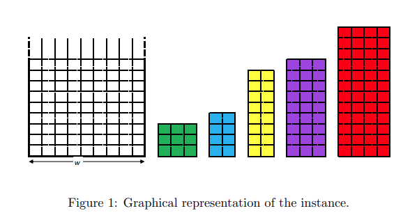

# Very large Scala Inetegration (VLSI)

VLSI (Very Large Scale Integration) refers to the trend of integrating circuits into silicon chips.
A typical example is the smartphone. The modern trend of shrinking transistor sizes, allowing engineers to fit more and more transistors into the same area of silicon, has pushed the integration of more and more functions of cellphone circuitry into a single silicon die (i.e. plate). 
This enabled the modern cellphone to mature into a powerful tool that shrank from the size of a large brick-sized unit to a device small enough to comfortably carry in a pocket or purse, with a video camera, touchscreen, and other advanced features. 
As the combinatorial decision and optimization expert, you are assigned to design the VLSI of the circuits defining your electrical device: given a fixed-width plate and a list of rectangular circuits, decide how to place them on the plate so that the length of the final device is minimized (improving its portability).
In order for the device to work properly, each circuit must be placed in a fixed orientation with respect to the others, therefore it cannot be rotated.
  
  

## Description of instances
Instance Format An instance of VLSI is a text file consisting of lines of
integer values. The first line gives w, which is the width of the silicon plate.
The following line gives n, which is the number of necessary circuits to place
inside the plate. Then n lines follow, each with xi and yi
, representing the
horizontal and vertical dimensions of the i-th circuit. For example, a file
with the following lines:
9  
5  
3 3  
2 4  
2 8  
3 9  
4 12  
describes an instance in which the silicon plate has the width 9, and we need
to place 5 circuits, with the dimensions 3 × 3, 2 × 4, 2 × 8, 3 × 9, and 4 × 12.
Figure 1 shows the graphical representation of the instance.
Solution Format Where to place a circuit i can be described by the
position of i in the silicon plate. The solution should indicate the length of
the plate l, as well as the position of each i by its ˆxi and ˆyi
, which are the coordinates of the left-bottom corner i. This could be done by for instance
adding l next to w, and adding ˆxi and ˆyi next to xi and yi
in the instance
file. To exemplify, the solution of the instance depicted in Figure 1 could
look like:
9 12  
5  
3 3 4 0  
2 4 7 0  
2 8 7 4  
3 9 4 3  
4 12 0 0  
which says for instance that the left-bottom corner of the 3 × 3 circuit is at
(4, 0). The solution can be represented graphically as in Figure 2.   
